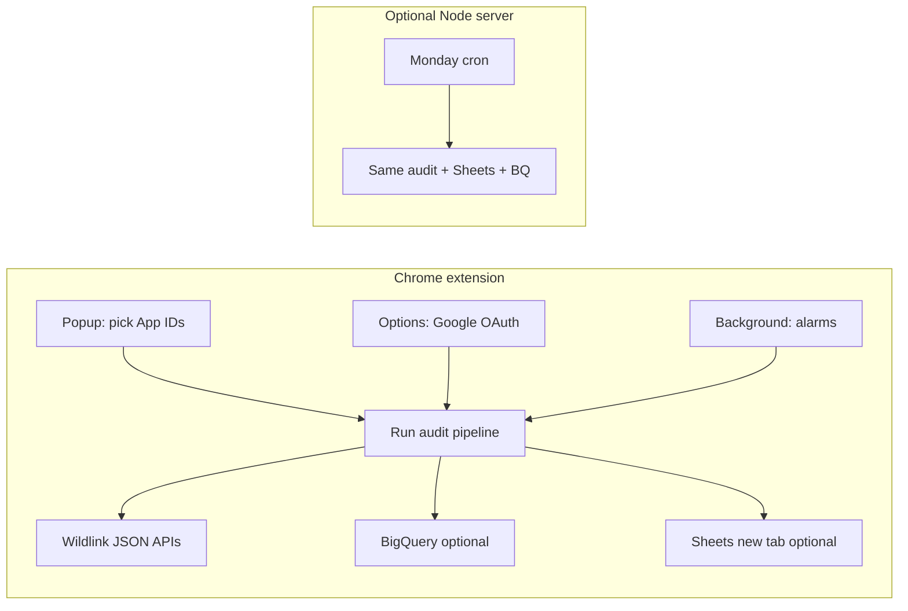
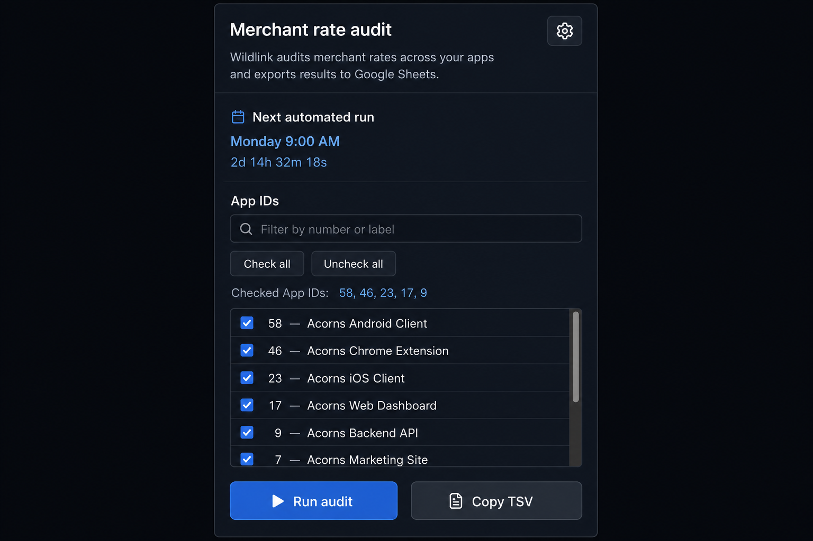
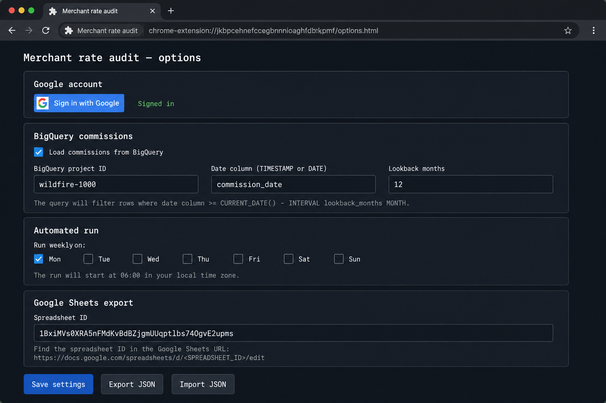
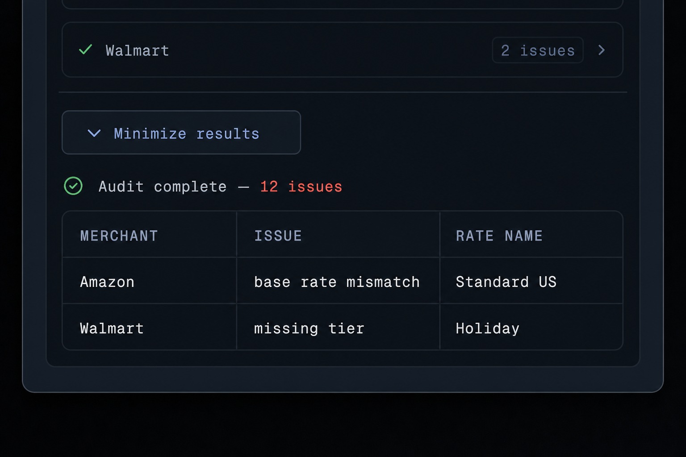

# Merchant rate weekly report

Self-contained toolkit: a **Chrome extension (MV3)** for day-to-day Wildlink **merchant rate audits**, plus an optional **Node** app for **scheduled** runs, **BigQuery** commissions, and **Google Sheets** export using a **service account**.

The extension runs the same **`auditAppId`-style checks** as the bundled `merchant-rate-auditor` and can use **your Google account** (OAuth) for **read-only BigQuery** and **Sheets**—aligned with the weekly commission query and “new tab per run” behavior in `lib/`.

---

## Release notes (v1.7.0)

- **Stable extension ID:** `manifest.json` includes a fixed `key` (public RSA key) so every developer and machine gets the **same** extension ID when loading **Load unpacked** on `extension/`. One **Chrome extension** OAuth client in Google Cloud can serve the whole team.
- **OAuth setup:** Use a Google Cloud OAuth client of type **Chrome extension** whose **Item ID** matches the ID shown in `chrome://extensions` for this build (see [Extension ID](#extension-id-stable-across-machines) below).
- **Private key (Web Store only):** A generated `oauth-extension-private-key.pem` may exist locally for Chrome Web Store packaging; it is **gitignored** and not required for OAuth sign-in.
- **UI:** Popup uses a **searchable App ID checklist** (Wildlink app catalog with display names), **gear** for settings, optional **weekly automated run** countdown, **Run audit** / **Copy TSV**, and an in-popup results table.
- **Documentation:** This README, workflow overview, and **representative UI images** under `docs/screenshots/` (generated for docs; substitute your own captures if you need marketing-grade pixels).

---

## How it works (high level)



1. You select **App IDs** in the popup (defaults come from the bundled catalog; changes persist in `chrome.storage`).
2. **Run audit** loads merchant/rate data from Wildlink, runs validation (`extension/lib/auditor-core.js`, kept in sync with `merchant-rate-auditor/auditor.js`).
3. If signed in and enabled, **BigQuery** supplies commission rows (same idea as `lib/weekly-commission-fetch.js`).
4. If enabled, **Google Sheets** creates a **new tab** with the result (`extension/lib/google-sheets-rest.js`).
5. Optionally, **alarms** run the same pipeline on a **weekly schedule** using the IDs you last checked in the popup.

---

## Screenshots (representative UI)

Images are **layout-accurate mockups** of the current dark theme and structure; your installed build may differ slightly as the product evolves.

| Popup: App IDs, schedule, run | Options: Google, BigQuery, Sheets, schedule |
|:---:|:---:|
|  |  |

| After a run: status + results table |
|:---:|
|  |

---

## Chrome extension (primary workflow)

### Install

1. Chrome → **Extensions** → turn on **Developer mode**.
2. **Load unpacked** → select the **`extension/`** directory inside this repo (the folder that contains `manifest.json`).
3. On first install, **Options** may open in a tab—use **Sign in with Google** if you need BigQuery/Sheets.

### Daily use

1. Click the **toolbar icon** to open the popup.
2. **Search / filter** the App ID list, use **Check all** / **Uncheck all** as needed. The line **Checked App IDs** shows the current selection (this is what scheduled runs use too).
3. Open **Settings** via the **gear** (or the settings link) for Google sign-in, BigQuery, Sheets ID, and weekly automation.
4. **Run audit**; use **Copy TSV** to copy tab-separated results. With Sheets enabled, a new tab is created on the configured spreadsheet.

### Extension ID (stable across machines)

The committed `key` field pins the extension ID to:

**`nolphancinloiailnljmghapllgabogh`**

Confirm under `chrome://extensions` after load. When creating the **Chrome extension** OAuth client in Google Cloud, register **this** ID.

### Google Cloud setup (OAuth)

1. Enable **BigQuery API** and **Google Sheets API** for your project (or use an existing project your account can access).
2. **Credentials** → **Create credentials** → **OAuth client ID** → Application type **Chrome extension** → paste the extension ID above.
3. Put the issued **Client ID** string in `extension/manifest.json` under `oauth2.client_id` (must be the bare `….apps.googleusercontent.com` value, **no** `http://` prefix).
4. **Reload** the extension in `chrome://extensions`.
5. In **Options**, click **Sign in with Google** and accept scopes (BigQuery read-only + Sheets).

If you see **bad client id**, the client is not type **Chrome extension**, the ID in Cloud Console does not match the extension, or `client_id` in the manifest is wrong—fix and reload.

**Export / import JSON** (Options) backs up settings such as App IDs, flags, and spreadsheet ID; it does **not** include OAuth refresh tokens.

### Logic parity (extension vs Node)

| Area | Extension | Node / server |
|------|-----------|----------------|
| Wildlink audit | `extension/lib/auditor-core.js` | `merchant-rate-auditor/auditor.js` |
| BigQuery commissions | `extension/lib/google-bq.js` | `lib/weekly-commission-fetch.js` |
| New Sheet tab | `extension/lib/google-sheets-rest.js` | `lib/sheets.js` |

When rate rules change upstream, update **both** the auditor and `auditor-core.js` (or regenerate from the same source).

---

## Optional: Node server (cron + service account)

Use for **automated** weekly runs without a browser sign-in.

### Requirements

- **Node.js 18+**
- Network access to Wildlink, Google APIs, and (optional) BigQuery

### Quick start

```bash
cd merchant-rate-weekly-report
npm install
cp .env.example .env
```

1. Add Google **service account** JSON under `secrets/` (e.g. `secrets/google-sheets-key.json`).
2. Edit `.env`: `GOOGLE_APPLICATION_CREDENTIALS`, `SPREADSHEET_ID`, and optional BigQuery / cron / `PORT` (see `.env.example`).
3. Share the spreadsheet with the service account as **Editor**.
4. `npm start` — open **http://localhost:3847** (or your `PORT`) for the legacy web UI, or rely on cron only.

### Sheets smoke test

```bash
npm run test:sheets
```

---

## Sharing this folder

Zip the directory **without** secrets or heavy artifacts:

```bash
cd ..
zip -r merchant-rate-weekly-report.zip merchant-rate-weekly-report \
  -x "merchant-rate-weekly-report/node_modules/*" \
  -x "merchant-rate-weekly-report/secrets/*.json" \
  -x "merchant-rate-weekly-report/data/last-run.json" \
  -x "merchant-rate-weekly-report/extension/oauth-extension-private-key.pem"
```

Recipients: unpack, **Load unpacked** on `extension/`, and optionally `npm install` + `.env` for the server path.

---

## Layout

| Path | Purpose |
|------|---------|
| `extension/` | MV3 extension — popup, options, background, audit + optional OAuth BigQuery/Sheets |
| `extension/manifest.json` | Version, `oauth2`, pinned `key`, permissions |
| `docs/screenshots/` | README UI images |
| `server.js` | Express + `/api/*` + Monday `node-cron` (optional) |
| `public/index.html` | Legacy web UI (optional) |
| `lib/` | Node audit runner, Sheets sync, commission fetch, next-run countdown |
| `data/` | `config.json`, `last-run.json` (runtime) |
| `secrets/` | Service account JSON (not committed) |
| `merchant-rate-auditor/` | Bundled Node `auditor.js` + `offer-activation-auditor.js` |

The Node path `chdir`s into `merchant-rate-auditor/`; dependencies resolve from the parent `node_modules` (single `npm install` at repo root).

---

## Security

- Never commit `.env`, `secrets/*.json`, or `oauth-extension-private-key.pem`.
- Prefer a service account scoped only to spreadsheets you share.
- OAuth tokens stay in Chrome’s identity store, not in exported JSON.
